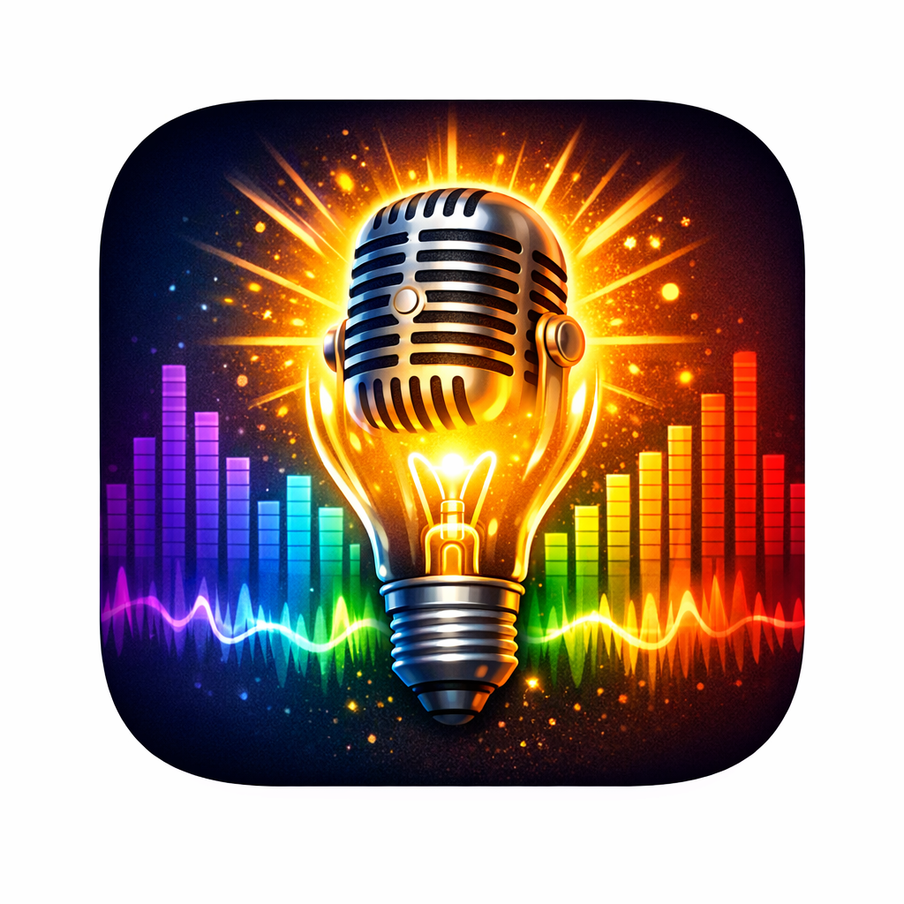

# ChromaSound

**Real-Time Audio Frequency Visualiser for Android**

> Version 2.8.0 · Build 17 · ThinkingThane / FunAndGames · Pickering, Ontario, Canada

ChromaSound captures microphone audio, processes it through a custom pure-Kotlin FFT, and renders animated coloured visual objects on screen — one per frequency band — with beat detection, haptic feedback, and extensive visual customisation. Completely ad-free, zero data collection, Google Drive backed-up.

---

## At a Glance

| Property | Detail |
|---|---|
| Language | Kotlin + Jetpack Compose (Material 3) |
| Architecture | MVVM — AndroidViewModel + StateFlow + SharedPreferences |
| Audio engine | AudioRecord, UNPROCESSED source, 44,100 Hz |
| FFT | Pure Kotlin Cooley-Tukey radix-2, 4,096-sample frames (~93ms) |
| Frequency range | 30 Hz – 11,000 Hz across 2–24 log-spaced bands |
| Shape types | 10 (Circle, Star, Box 2D, Box 3D, Sphere, Koch, Sierpinski, Dragon, Vector, Ribbon) |
| Background effects | 6 (None, Starfield, Bloom, Noise, Julia, Terrain) |
| Source files | 14 Kotlin files, ~4,500 lines |
| Min SDK | API 26 (Android 8.0) |
| Target SDK | 34 |
| Data collection | **None** — zero analytics, zero tracking |
| Ads | **None** — always ad-free |

---

## Features

### Audio Processing

- **Real-time FFT** — 4,096-sample Hann-windowed frames at ~10fps audio-driven updates
- **Frequency bands** — 2–24 log-spaced bands from 30 Hz to 11 kHz, configurable
- **Auto-Gain Control (AGC)** — asymmetric attack/release normalises quiet and loud input automatically; manual sensitivity still works on top
- **Noise gate** — –70 to –20 dBFS spawn threshold keeps silence clean
- **Beat detection** — rolling RMS history, configurable sensitivity 1.1×–2.5×, minimum 250ms gap
- **BPM display** — median of last 8 beat intervals, 20–240 BPM range, preserved between frames
- **Sub-band shading** — 1–12 log-spaced frequency slices per band drive radial gradient shading on each shape
- **Waveform overlay** — 256-point PCM downsample rendered as a glowing full-screen line

---

### Shape Types

Selected in **Settings → VISUAL → OBJECT SHAPE**. All shapes use the same frequency colour, dB-driven size, and lifetime system.

| Icon | Shape | Description |
|---|---|---|
| ● | Circle | Radial gradient glow disc with sub-band shading rings |
| ★ | Star | 5-point star path with sub-band gradient fill |
| ■ | Box 2D | Flat rectangle with linear gradient |
| ⬡ | Box 3D | 6-face 3D projection, rotates continuously |
| ◉ | Sphere | Disc with latitude and longitude arc lines, rotates continuously |
| ❄ | Koch | Koch snowflake — depth 1–4 driven by dB level |
| △ | Sierpinski | Sierpinski triangle — recursive depth 1–4 driven by dB level |
| ∾ | Dragon | Heighway dragon curve — iterations 6–12 driven by dB level |
| → | Vector | Spinning arrow per band — length=dB, rotates around midpoint, 15s lifetime with 3s fade, new vector every 1s |
| ∿ | Ribbon | Flowing silk ribbon wave — amplitude=dB, undulation rate=frequency band, tapered pointed tips, drifts slowly outward |

---

### Background Effects

| Icon | Effect | Description |
|---|---|---|
| ■ | None | Solid near-black (#050508) — maximum contrast for shapes |
| ✦ | Starfield | 120 drifting stars with glow halos (3–8px), speed increases on beats |
| ◉ | Bloom | Purple radial gradient pulsing with RMS volume — always-on base glow plus reactive centre burst |
| ▦ | Noise | Two-layer animated chromatic grain — 80 slow blobs plus 300 fine fast dots |
| ∞ | Julia | Julia set fractal rendered at 100×178px — complex seed `c` driven by dominant frequency (cx) and RMS volume (cy). Morphs in real time with the audio |
| ⛰ | Terrain | 3D perspective frequency landscape — 30-row ring buffer scrolls toward viewer. X=frequency band, Y=dB height, coloured by frequency. Painter's algorithm (back-to-front) |

---

### Visual Effects

- **Mirror modes** — Off, Horizontal, Vertical, Quad (4-fold symmetry)
- **Shape trails** — 0–8 ghost frames of previous positions, fading with age
- **Beat pulse** — spring animation to 1.4× scale and back on each detected beat
- **Colour animation** — continuous hue drift at 0–3× speed
- **Shape opacity** — global transparency 20–100%; lower values create atmospheric layered depth
- **Oscilloscope ring mode** — shapes draw as hollow pulsing rings whose radius contracts and expands with sub-band energy
- **Particle explosions** — 8-particle bursts on loud transients, 0.92× drag physics, 200-particle cap
- **Peak frequency label** — Hz or kHz value floats above the loudest active shape, colour-matched, fades with shape lifetime
- **Haptic feedback** — 40ms VibrationEffect on each beat
- **Dark / Light / System theme** — canvas always stays dark (BlendMode.Screen requires it); theme applies to UI chrome only

---

### Presets & Sharing

- Save up to **10 named presets** to SharedPreferences
- **5 built-in themes** — Neon Noir, Solar Flare, Arctic, Deep Ocean, Classic
- **Preset share codes** — `CS:...` Base64-encoded codes, share via any messaging app, import by pasting
- **Google Drive Auto Backup** — presets and settings survive reinstall and phone migration

---

## Settings Reference

### 🎵 Frequency & Timing

| Setting | Default | Range | Description |
|---|---|---|---|
| Frequency Bands | 16 | 2–24 | Number of log-spaced bands from 30 Hz to 11 kHz |
| Shape Lifetime | 500 ms | 100–2000 ms | How long each shape lives before fading |
| Shapes Per Band | 1 | 1–5 | Concurrent shapes occupying each band slot |

### 📐 Size & Position

| Setting | Default | Range | Description |
|---|---|---|---|
| Min Size | 10 px | 5–120 px | Minimum shape radius (at noise gate level) |
| Max Size | 160 px | 20–250 px | Maximum shape radius (at 0 dBFS) |
| Placement | 0.3 | 0–1 | 0 = strict grid columns, 1 = fully random position |

### 🎙️ Audio

| Setting | Default | Range | Description |
|---|---|---|---|
| Auto-Gain Control | On | On / Off | Automatically normalises quiet and loud input levels |
| Mic Sensitivity | 1.0× | 0.1–3.0× | Manual gain multiplier applied on top of AGC |
| Noise Gate | –50 dBFS | –70 to –20 | Threshold below which no shapes spawn |

### 🎨 Visual

| Setting | Default | Range | Description |
|---|---|---|---|
| Shape Opacity | 100% | 20–100% | Global transparency of all shapes |
| Sub-Band Shading | 4 rings | 1–12 | Radial gradient rings per shape driven by sub-band energy |
| Colour Scheme | Rainbow | Rainbow / Inverse | Bass→red→violet or violet→red→bass |
| Object Shape | Circle | 10 types | See Shape Types section |
| Band Colours | — | Per-band HSV | Override any individual band with a custom colour |
| Display Theme | Dark | Dark/Light/System | Canvas always dark; theme applies to UI chrome |

### ✨ Effects

| Setting | Default | Range | Description |
|---|---|---|---|
| Mirror Mode | Off | Off/H/V/Quad | Reflects shapes horizontally, vertically, or in all 4 quadrants |
| Shape Trails | 0 | 0–8 | Ghost frames of previous shape positions |
| Beat Sensitivity | 1.3× | 1.1–2.5× | RMS multiplier threshold for beat detection |
| Colour Animation | 0 | 0–3× | Speed of continuous hue drift |
| Waveform Overlay | Off | On/Off | Full-screen PCM waveform line |
| Oscilloscope Mode | Off | On/Off | Shapes become hollow pulsing rings |
| Particles | Off | On/Off | Burst of 8 particles on loud transients |
| Particle Threshold | 0.6 | 0.1–1.0 | RMS level that triggers particle bursts |
| Background Effect | None | 6 types | See Background Effects section |

---

## Architecture

### Audio Pipeline

Each audio frame flows through these steps at ~93ms intervals:

1. Read 4,096 PCM float samples from `AudioRecord` (UNPROCESSED source, READ_BLOCKING)
2. Compute RMS = `sqrt(sum(s²) / N)`, coerced to [0, 1]
3. Apply Hann window to reduce spectral leakage
4. Run Cooley-Tukey FFT → 2,048 normalised magnitude bins
5. Auto-Gain Control or manual sensitivity gain applied to dBFS levels
6. Find peak bin per band above noise gate threshold
7. Compute sub-band energies — N log-spaced slices per band, normalised to peak
8. Beat detection — `avgRms` computed **before** adding current frame to history (critical ordering)
9. BPM calculation — median of last 8 beat intervals, coerced 20–240
10. Emit `AudioFrame` via Kotlin Flow on `Dispatchers.IO`

### Source Files

| File | Purpose |
|---|---|
| `ChromaSoundScreen.kt` | Root composable, all navigation, VisualizerCanvas, all shape/effect drawing (~1,891 lines) |
| `SettingsScreen.kt` | Settings hub + 5 sub-screens (~1,000 lines) |
| `PresetsScreen.kt` | NamedPreset, save/load/share/paste codes, built-in themes (~788 lines) |
| `ChromaSoundViewModel.kt` | AndroidViewModel, StateFlows, shape spawning, persistence, haptics |
| `AudioCaptureEngine.kt` | AudioRecord loop, FFT, AGC, beat detection, BPM, waveform |
| `Models.kt` | All enums + data classes (Settings, FrequencyCircle, AudioFrame, BandDefinition) |
| `FFTEngine.kt` | Cooley-Tukey radix-2 FFT + Hann window |
| `FrequencyColorMapper.kt` | Hz → HSV colour mapping via log-scaled frequency |
| `ChromaTheme.kt` | ChromaColors, DarkChromaColors, LightChromaColors, LocalChromaTheme |
| `MainActivity.kt` | Window setup, permissions, WindowSizeClass, PixelCopy screenshot |
| `BandColorScreen.kt` | Per-band HSV colour override picker |
| `HelpScreen.kt` | 13-section scrollable help screen |
| `OnboardingScreen.kt` | 3-page HorizontalPager first-launch flow |

### Key Technical Decisions

**Pure Kotlin FFT** — Cooley-Tukey implemented in pure Kotlin with no JNI or native dependency. For 4,096-sample frames at ~10fps the JVM overhead is negligible and the code is fully debuggable.

**Single Canvas** — one Compose `Canvas` composable for all rendering. Multiple stacked Canvas composables accumulate without clearing. The canvas clears itself with `drawRect` at the start of every frame.

**Waveform as separate StateFlow** — `StateFlow<List<Float>>` rather than a field inside `UiState`. `FloatArray` uses reference equality and would never trigger recomposition. `List<Float>` uses structural equality and triggers correctly every frame.

**Canvas DrawScope state tracking** — Compose's `Canvas` `DrawScope` is not `@Composable`. State reads inside it are invisible to the snapshot system. Variables like `rmsVolume` and `nowMs` must be read in the composable body before the `Canvas{}` lambda.

**Mirror mode via coordinate reflection** — reflected `(x, y)` coordinates are computed per shape rather than using canvas transforms. `withTransform(scale(-1))` causes full-canvas bleed between frames.

---

## Build History

| Build | Version | Key Features Added |
|---|---|---|
| 1 | 1.0 | Screen always-on, settings persistence, noise gate slider |
| 1b | 1.0 | Window config moved to `onCreate()` — fixed status bar flicker |
| 2 | 1.1 | Named presets, 5 built-in themes, preset save/load/delete |
| 3–3e | 1.2 | Mirror modes (H/V/Quad), shape trails, canvas clearing fixed |
| 4 | 1.3 | Beat detection, BPM display, haptic feedback |
| 5–5g | 1.4–1.5 | Colour animation, waveform overlay, waveform StateFlow fix |
| 6–6b | 1.6 | Screenshot export, PixelCopy API, preset stale closure fix |
| 7–7b | 1.7 | Preset share codes (CS:...), RMS history graph, sub-band shading |
| 8 | 1.8 | Settings hub redesign — 5 themed sub-screens |
| 9–9c | 1.9 | Haptic feedback UI, preset sharing buttons, Google Drive backup |
| 10 | 2.0 | 3-page onboarding flow (HorizontalPager) |
| 11–11c | 2.1 | Particles, oscilloscope rings, Starfield/Bloom/Noise backgrounds, help screen |
| 12–12n | 2.2–2.3 | Tablet adaptive layout, Dark/Light/System theme, canvas DrawScope fix |
| 13 | 2.4 | Auto-Gain Control, shape opacity slider, peak frequency label |
| 14 | 2.5 | Koch/Sierpinski/Dragon fractal shapes, Julia set background |
| 15 | 2.6 | Terrain background — 3D perspective frequency landscape |
| 16 | 2.7 | Vector shape — spinning frequency arrows, 15s lifetime |
| 17 | 2.8 | Ribbon shape — flowing silk wave, tapered, audio-driven undulation |

---

## Build & Deployment

### Requirements

- Android Studio Hedgehog or later
- JDK 17+
- Android SDK 34

### Build from Source

```bash
git clone https://github.com/ThinkingThane/chromasound.git
cd chromasound
./gradlew assembleDebug
```

### Release Build

```bash
./gradlew assembleRelease
```

### GitHub Actions CI/CD

A workflow at `.github/workflows/build.yml` builds and signs the release APK on every push to `main`. Required repository secrets:

| Secret | Purpose |
|---|---|
| `KEYSTORE_BASE64` | Base64-encoded release keystore |
| `KEY_ALIAS` | Key alias within the keystore |
| `KEY_PASSWORD` | Key password |
| `STORE_PASSWORD` | Keystore password |

---

## Permissions

| Permission | Reason | User Prompt? |
|---|---|---|
| `RECORD_AUDIO` | Real-time microphone capture for FFT analysis | Yes — at first launch |
| `VIBRATE` | Haptic feedback on beat detection | No — normal permission |
| `WRITE_EXTERNAL_STORAGE` (max API 28) | Screenshot save on Android 8/9 | No — granted at install |

---

## Privacy

- ChromaSound collects **no user data** of any kind
- No analytics, no crash reporting, no advertising SDKs
- Audio is processed entirely on-device — no audio data leaves the phone
- The only data written to storage is your settings and presets in SharedPreferences
- Google Drive Auto Backup (settings + presets) can be disabled in Android system settings

---

*ChromaSound v2.8.0 · ThinkingThane / FunAndGames · April 2026*
